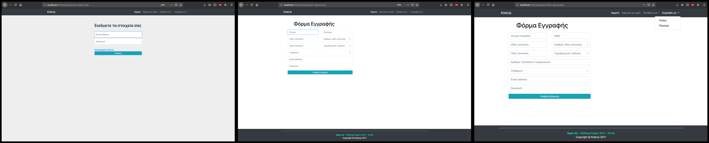

# KidsUp  

## Description:

**An online platform-application designed to provide activities for children. Parents-Clients can crete an account in order borwse activities for their children or buy tickets for these activities. Providers can create a provider account and create activity ads and sell tickets. A secure transactional system is used for buying and selling tickets. Moreover the a complete search system is designed used elastic search in order to much the best results for users search. Passwords are encrypted to guarantee security and https is used. Also a binary dependancy file has been developed to add watermarks to activity photos. The administrator can validate new users or delete existing users and has acceess to statistics of the application for example about users, tickets sold, profit etc. Below are some photos of the deployed app showing pages about activities and sign up/in forms**

**Forms:**

**examples of activties:**

______________________________________

# Team Name: Team42 

## Members:

| &ensp; _**SURNAME**_ &ensp; &ensp; &ensp; &ensp; _**NAME**_ &ensp; &ensp; &ensp; &ensp; _**Mail**_   
-

*  `Αδάμης           Δημήτριος          dimitrisadamis1994@gmail.com`

*  `Αθανασόπουλος    Γεώργιος           athanasopoulosgeorge95@gmail.com`

*  `Δράγαζης         Νικόλαος           ndragazis@outlook.com.gr`

*  `Καράκος          Γεώργιος           karakosg@hotmail.gr`

*  `Καραμουσαδάκης   Μιχάλης            mike95gr@hotmail.com`

*  `Πέτρου           Γεώργιος           tedroark7@gmail.com`
            			  						      
*  `Σκούρας          Κωνσταντίνος       konst.skouras@gmail.com`

# Tech Stack:

* **Backend**: php
* **Frontend**: HTML5, CSS, JavaScript, JQuery, Bootstrap
* **Database**: MySQL + ElasticSearch
* We used xammp for PHP and MYSQL.

# Build:

For building the application automatically we used **Phing** automation build tool. The file build.xml contains all the parameters required for phing, change the paths appropriataly in the build.xml file and type:

`Phing`

This will build the application automatically.

## _License_

This project is licensed under the GPLv3 License - see the [LICENSE](LICENSE) file for details
